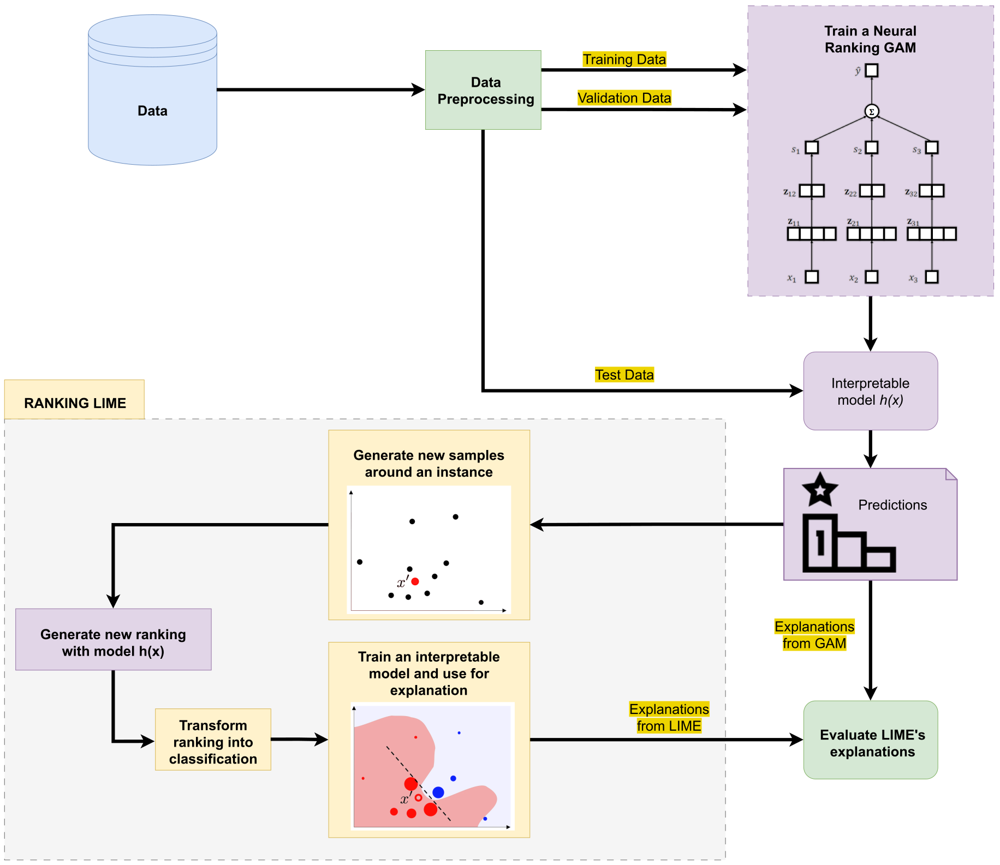
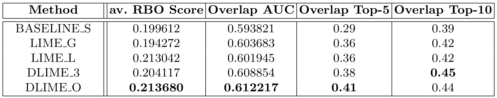
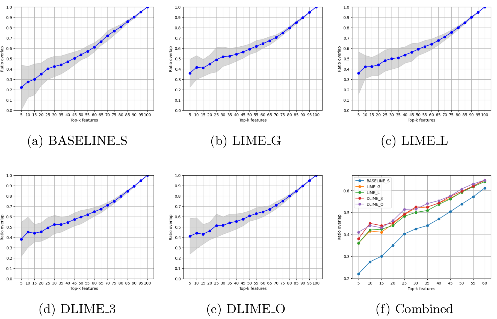

#  Local Interpretable Model-Agnostic Explanations for Ranking Model Interpretability

The paper can be accessed [here](https://drive.google.com/file/d/1RE97DIV4TzdWkpBDbKeD1l_xTj0B8doy/view?usp=sharing).

## Abstract

```
Interpreting the factors influencing the ranking positions is crucial for understanding
and improving learning-to-rank models. While Generalized Additive Models (GAMs) have
gained popularity as interpretable models in learning-to-rank, the interpretability of
neural ranking GAMs is limited due to computational intensity, scalability challenges,
and potential overfitting, which make GAMs impractical for real-world applications and
tasks with complex requirements. In this paper, we assess the effectiveness of Local
Interpretable Model-Agnostic Explanations (LIME) in explaining ranking models as an
alternative to inherently interpretable models. Our approach utilizes LIME to generate
explanations for a neural ranking GAM and analyse LIME explanations to those derived from
the interpretable ranking model. We also explore the impact of different LIME sampling
techniques and introduce the novel metric "Overlap AUC" to measure feature importance overlap.
The experimental results show notable differences among different sampling techniques within
LIME and their impact on the overlap of the top-5 and top-10 features.
```
## Dataset
The dataset used in this paper can be found [here](https://webscope.sandbox.yahoo.com/catalog.php?datatype=c&guccounter=1&guce_referrer=aHR0cHM6Ly93d3cuZ29vZ2xlLmNvbS8&guce_referrer_sig=AQAAABaUSejzCXXbRx_JEL4wOe861J9oqcg6mVwOEukD-zkS7GMD_dz3UpGnBxfZxq7ZHyA0jKLQ6VTXl-vBmvxJ_X2pb2P60L3Z1AYJoCtsxYMJUtTvV3RLmLxkfGyVnHMKuBMgN_ir9x_eCmLlYmdwWwHL5813V7Ks-Lube4hY1QOx).

## Experimental Framework

After data preparation, we train a neural ranking GAM using TensorFlow Ranking library to later predict the ranking of unseen queries. The interpretability of GAMs allows understanding feature contributions because a sub-score is assigned to each feature of the ranked documents. These explanations are used as ground truth to evaluate the explanations of a LIME.

Our ranking LIME consists of the following steps: 

1. New samples are generated by perturbing the feature values of the original instance. 
2. The GAM model outputs a ranking for each of these perturbed samples after replacing the
original instance in the set of documents with the sample.
3. Each sample is assigned a relevant or irrelevant label using the Top-k binary algorithm. 
4. An interpretable model is trained using the labeled samples. 
5. The explanations generated by the neural ranking GAM and the surrogate model are compared.



### Setup Environment

The following python environment and packages are used to conduct the experiments:
- Python==3.9.16
- numpy==1.23.5
- pandas==2.0.1
- scikit-learn==1.2.2
- spicy==1.10.1
- tensorflow==2.12.0
- matplotlib==3.7.1
- pyDOE2==1.3.0

## Metrics

<b>RBO:</b> considers the order of items in the lists, assigning higher weights to the items at the top ranks. This is one advantage over its alternative, Kendall tau, because it emphasizes the disagreement at the top positions of the ranking, rather than treating all ranking positions equally. 

<b>Ratio Overlap:</b> measures the overlap between consecutive sets of top relevant features and generates a vector of overlap values. The area under the function resulting from interpolating these values is named "Overlap AUC".

## Results

The quality of LIME explanations is compared below for different sampling technques: 



A more detailed comparison for consecutive sets of features is appreciated in the following plots:


